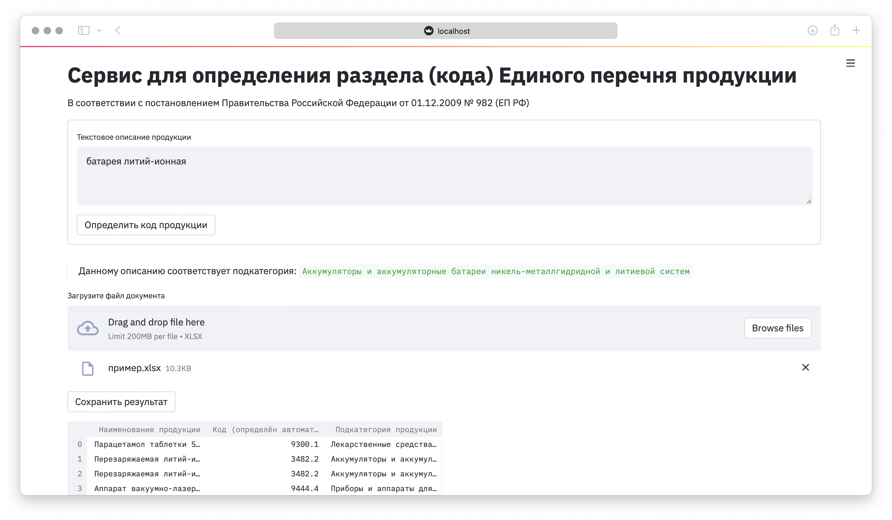

# Решение кеса №1: ИИ на страже качества российских товаров
> Хакатоны по искусственному интеллекту  
> г. Челябинск, c 19 ноября по 21 ноября


## Описание задания
Участникам хакатона предстоит создать модель машинного обучения для верификации сведений, содержащихся в документах об оценке соответствия продукции (товаров).

Задача для хакатона построена на примере автоматизации определения раздела (кода) Единого перечня продукции, подтверждение соответствия которой осуществляется в форме принятия декларации о соответствии, утвержденного постановлением Правительства Российской Федерации от 01.12.2009 № 982 (ЕП РФ).

Набор данных состоит из следующих атрибутов:

текстовое описание продукции (1 предложение);
код, присвоенный заявителем (может содержать неточности в описании);
категория и подкатегория.
Код ЕП РФ определяет, какие тесты на безопасность для потребителей проходит тот или иной товар, поэтому очень важно точно определять его тип.

В документах об оценке соответствия продукции требованиям законодательства (сертификаты соответствия, декларации о соответствии и т.д.) заявителями могут быть внесены (умышленно или по ошибке) некорректные значения: указан неверный раздел ЕП РФ (код), категория, подкатегория продукции и т.д. Объём выпускаемой продукции в России делает невозможной ее ручную валидацию сведений. Модель машинного обучения позволит полностью автоматизировать этот процесс и снизить процент ошибок и несоответствий.

Постановщиком задачи выступает Росаккредитация.  

ссылка на сайт конкурса - https://hacks-ai.ru/hakaton/chelyabinsk


## Описание структуры репозитория
```
|-data                                  - данные, векторизаторы и справочники
|    |-raw                              - исходные файлы данных
|    |-processed                        - предобработанные данные
|-models                                - директория с моделями машинного обучения
|-app-config.yaml                       - файл кофигурации приложения
|-app.py                                - файл приложения
|-data-preprocessing.py                 - скрипт для предобработки исходных данных
|-dataset-preparing-mm.ipynb            - ноутбук с отработкой подходов препроцессинга
|-eda-baseline-model-building-mm.ipynb  - анализ, построение базовой модели
|-frod-docs.csv                         - перечень документов, похожих на мошеннические
|-prod-model-tuning-mm.ipynb            - ноутбук с поиском лучших гиперпараметров модели
|-requirements_conda.txt                - перечень библиотек conda из рабочего окружения
|-requirements_pip.txt                  - перечень библиотек pip из рабочего окружения
|-terms_to_delete.txt                   - перечень выделенных векторизатором терминов, 
которые желательно удалять (неполный в силу ограниченного времени соревнования)
```

## Установка и запуск приложения
- установите библиотеку `streamlit`
```terminal
pip install streamlit
```
- установите дополнительные библиотеки, необходимые для работы приложения: `nltk, re, yaml, pickle, gc, pymystem3`
- находясь в корневой директории репозитория выполните команду:  
```terminal
streamlit run app.py
```
автоматически откроется окно браузера и в нём загрузится сраница приложения



## Описание ML-задачи
Необходимо решить задачу многоклассовой классификации с дисбалансом.

### Описание моделей
На текущий момент в веб-приложении используется линейная модель `LinearSVC`, которая была выбрана по итогу сравнения результатов нескольких классических моделей. Значение метрики `f1_weighted = 0.873119` на стратифицированной кросс-валидации по 5 фолдам.  
Так же имеется более точная нейроная сеть на базе `BERT` со значением метрики `f1_weighted = 0.91`, которая пока не интегрирована в веб-приложение, ввиду ограниченного времени соревнования, но может быть использована для валидации на отложенной выборке данных.
На валидационной выборке от экспертов точность на 2м и 3м файлах составила 0.952 и 0.971 соответственно.

## Возможные пути улучшения качества
- написание парсера для удаления из данных наименований продукции
- более глубокий поиск гиперпараметров для линейной модели `LinearSVC`
- интеграция в приложение нейронной сети на базе `BERT`
